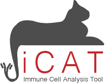

[](https://travis-ci.org/BioHPC/iCAT)

# Immune Cells Analysis software Tool  

High throughput sequencing of immune cell receptor sequences presents a unique opportunity to inform our understanding of immunological response to infection and how we can detect it. iCAT is a user-friendly, graphical-interface software that takes exposed and non-exposed samples of T-cell receptor (TCR) clonotypes as input and identifies pathogen-specific TCR sequences. Using these sequences, iCAT can also classify independent samples of TCR clonotypes. iCAT was able to identify vaccine-accosiated TCR seqeunces with up to 95% accuracy in mice. 

<br/>


### Pre-requisites:

* R version
  * Download R (>3.4.0) version from CRAN.
    * Windows: https://cran.r-project.org/bin/windows/base/
    * Mac OS X: https://cran.r-project.org/bin/macosx/
    * Linux: https://cran.r-project.org/bin/linux/

* Libraries:
    - devtools

To install devtools, use the command:

```
install.packages("devtools") 
```
        
*Note*: iCAT also uses shiny, shinyjs, data.table, ggplot2, DT, hash, and magrittr. However, those packages will be installed if using `install_github` from below.

### Installing iCAT

Using an R interface, type:
```
devtools::install_github("BioHPC/iCAT") 
```
